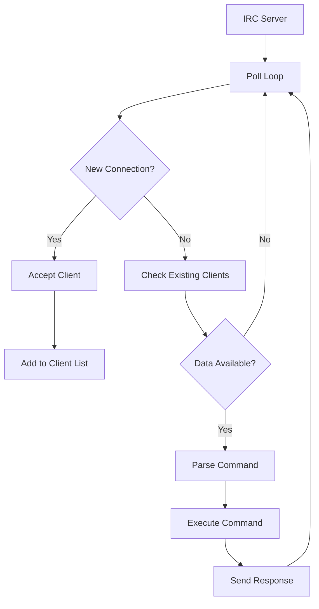

# IRC Server: 42 School Internet Relay Chat Project 💬🌐


[](https://42firenze.it/)
[](https://github.com/Nazar963/42_irc/blob/main/LICENSE)
[](https://github.com/Nazar963/42_irc/.github/workflows/build.yml)
[](https://tools.ietf.org/html/rfc1459)
[](https://github.com/Nazar963/42_irc)

A complete Internet Relay Chat (IRC) server implementation compliant with RFC 1459 and RFC 2812 standards, supporting multiple clients, channels, and real-time communication.

## Table of Contents 📖
- [Project Overview](#project-overview)
- [Features](#features)
- [Installation](#installation)
- [Usage](#usage)
- [Client Connection](#client-connection)
- [Supported Commands](#supported-commands)
- [Technical Implementation](#technical-implementation)
- [Testing](#testing)
- [RFC Compliance](#rfc-compliance)
- [Resources](#resources)
- [License](#license)

## Project Overview 

The IRC server project is a 42 School assignment that challenges students to implement a fully functional IRC server that:
- Handles multiple client connections simultaneously
- Supports standard IRC commands and protocols
- Manages channels with various modes
- Implements user authentication and registration
- Maintains communication between clients in real-time

**Key Specifications**:
- RFC 1459 compliant (Internet Relay Chat Protocol)
- RFC 2812 compliant (Internet Relay Chat: Client Protocol)
- Supports multiple clients via non-blocking I/O
- Handles basic IRC commands and error messages
- Implements channel operations with modes

## Features

### Core Functionality (Implemented)
| Feature | Description |
|---------|-------------|
| **Multi-client Support** | Non-blocking I/O with epoll() |
| **User Registration** | NICK, USER, PASS commands |
| **Channel Operations** | JOIN, PART, TOPIC |
| **Messaging** | PRIVMSG |
| **Channel Management** | INVITE, KICK |
| **Error Handling** | Basic error responses |

### Bonus Features (Fully Implemented) ⚠️
| Feature | Status | Description |
|---------|--------|-------------|
| **Channel Modes** | ✅ Basic | +o/-o (operator privileges) |
| **Custom Commands** | ✅ Implemented | POKE (Pokemon game feature) |
| **User Modes** | ✅ Not Implemented | +i (invisible), +o (operator) |
| **IRC Bots** | ✅ Not Implemented | Automated bot clients |

## Installation

### Requirements
- C++ compiler (g++ or clang++)
- Make
- Linux/macOS environment

### Compilation
```bash
# Clone repository
git clone https://github.com/Nazar963/42_irc.git
cd 42_irc

# Build server
make
```

### Makefile Targets
```makefile
all          # Compile server
clean        # Remove object files
fclean       # Remove objects and executable
re           # Rebuild server
```

## Usage

### Starting the Server
```bash
# Basic usage
./ircserv <port> <password>

# Example
./ircserv 6667 secure_password
```

## Client Connection

### Using IRC Client
```bash
# Install irssi (recommended client)
sudo apt-get install irssi

# Connect to server
irssi -c 127.0.0.1 -p 6667 -w secure_password
```

### Basic Client Workflow
1. Set nickname: `/nick your_nickname`
2. Register user: `/USER username hostname servername :Real Name`
3. Join channel: `/JOIN #channel`
4. Send message: `/PRIVMSG #channel :Hello World!`
5. List channels: `/LIST`

## Supported Commands 

### User Commands
| Command | Example | Description |
|---------|---------|-------------|
| `NICK` | `/NICK wizard42` | Set nickname |
| `USER` | `/USER user host servername :Real Name` | Register user |
| `JOIN` | `/JOIN #hogwarts` | Join channel |
| `PART` | `/PART #hogwarts` | Leave channel |
| `PRIVMSG` | `/PRIVMSG #general :Hello!` | Send message |
| `QUIT` | `/QUIT :Goodbye!` | Disconnect |

### Channel Operations
| Command | Example | Description |
|---------|---------|-------------|
| `TOPIC` | `/TOPIC #lobby :Welcome!` | Set channel topic |
| `INVITE` | `/INVITE friend #secret` | Invite user to channel |
| `KICK` | `/KICK #lobby troll` | Remove user from channel |
| `MODE` | `/MODE #study +o username` | Give operator privileges |

### Special Commands
| Command | Example | Description |
|---------|---------|-------------|
| `POKE` | `/POKE #channel` | Pokemon game feature |

## Technical Implementation

### Server Architecture


### Key Components
1. **Polling System**:
   ```c++
   epoll_event ev_lst[MAX_EVENTS];
   while (server_life) {
       int ev_nums = epoll_wait(srv.poll_fd, srv.ev_lst, MAX_EVENTS, -1);
       // Process events
   }
   ```

2. **Client Management**:
   ```c++
   class Client {
   public:
       int fd;
       std::string nickname;
       std::string username;
       std::string realname;
       std::vector<std::string> channels;
       // ...
   };
   ```

3. **Channel Management**:
   ```c++
   class Channel {
   public:
       std::string name;
       std::string topic;
       std::map<char, bool> modes;
       std::vector<Client*> members;
       // ...
   };
   ```

4. **Command Parser**:
   ```c++
   void handle_command(Client* client, std::string input) {
       std::istringstream iss(input);
       std::string command;
       iss >> command;
       std::transform(command.begin(), command.end(), command.begin(), ::toupper);
       
       if (command == "NICK") { /* ... */ }
       else if (command == "JOIN") { /* ... */ }
       // ...
   }
   ```

## Testing

### Manual Testing with Multiple Clients
```bash
# Terminal 1: Start server
./ircserv 6667 password

# Terminal 2: Client 1
irssi -c 127.0.0.1 -p 6667 -w password

# Terminal 3: Client 2
irssi -c 127.0.0.1 -p 6667 -w password

# Terminal 4: Client 3 (raw connection)
nc 127.0.0.1 6667
```

### Test Cases
1. **Connection Test**: Multiple clients connect simultaneously
2. **Registration Test**: PASS/NICK/USER commands
3. **Channel Test**: JOIN/PART/TOPIC commands
4. **Messaging Test**: PRIVMSG to users and channels
5. **Operator Test**: MODE +o/-o commands
6. **Pokemon Test**: POKE command functionality

## RFC Compliance

### Implemented Standards
| RFC | Section | Status |
|-----|---------|--------|
| 1459 | 4.1 Connection Registration | ✅ |
| 1459 | 4.2 Channel Operations | ✅ |
| 1459 | 4.3 Server Queries | ✅ |
| 2812 | 3.1 Connection Registration | ✅ |
| 2812 | 3.2 Channel Operations | ✅ |
| 2812 | 3.3 Sending Messages | ✅ |

### Numeric Replies
| Code | Name | Implemented |
|------|------|-------------|
| 001 | RPL_WELCOME | ✅ |
| 322 | RPL_LIST | ✅ |
| 331 | RPL_NOTOPIC | ✅ |
| 332 | RPL_TOPIC | ✅ |
| 401 | ERR_NOSUCHNICK | ✅ |
| 403 | ERR_NOSUCHCHANNEL | ✅ |
| 404 | ERR_CANNOTSENDTOCHAN | ✅ |
| 433 | ERR_NICKNAMEINUSE | ✅ |

## Resources

1. **Official Standards**:
   - [RFC 1459: IRC Protocol](https://tools.ietf.org/html/rfc1459)
   - [RFC 2812: IRC Client Protocol](https://tools.ietf.org/html/rfc2812)
   - [IRC Numeric Replies](https://modern.ircdocs.horse/#numerics)

2. **Development Tools**:
   - [IRSSI Client](https://irssi.org/)
   - [HexChat Client](https://hexchat.github.io/)
   - [nc (netcat) for raw testing](https://netcat.sourceforge.net/)

3. **Testing Resources**:
   - [IRC Server Test Cases](https://github.com/jesopo/bitbot)

4. **Reference Implementations**:
   - [InspIRCd](https://www.inspircd.org/)
   - [UnrealIRCd](https://www.unrealircd.org/)

## 🤝 Contributing
Feel free to submit issues or pull requests if you have suggestions for improving the application or adding more features.

## License
This project is licensed under the MIT License - see [LICENSE](LICENSE) for details.

## 📧 Contact
For questions or feedback, please open an issue in the repository.

## ⭐ Star this repository if you found it helpful!
[](https://github.com/Nazar963/42_irc/stargazers)

---

💬 *"Where 42 students chat about pointers and segmentation faults!"*  
[](https://profile-v3.intra.42.fr/users/naal-jen)
[](https://github.com/Nazar963)
[](https://github.com/Nazar963)

---

## 🍀 Goodluck:
Good luck with your IRC project at 42! 🚀